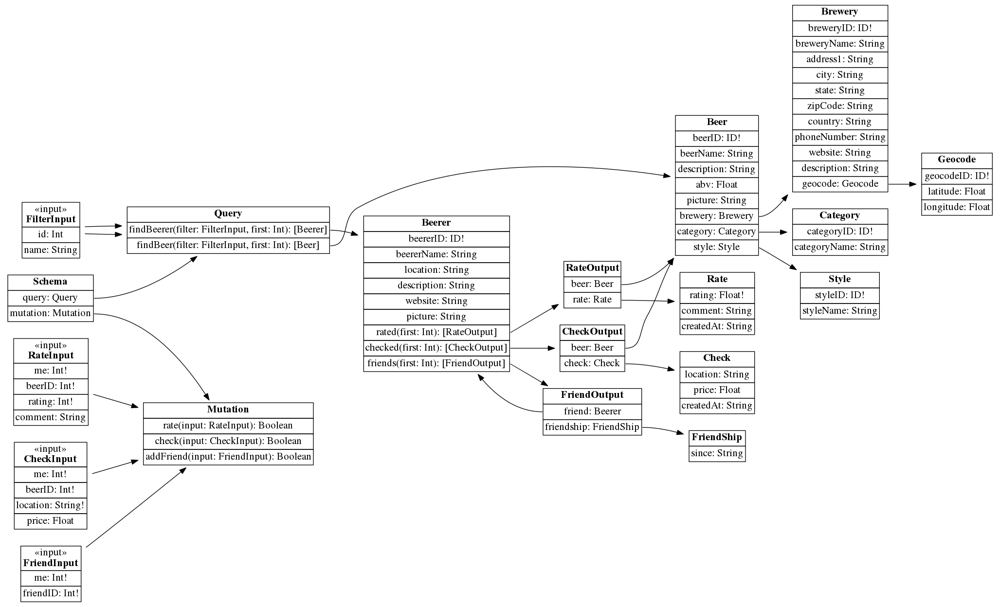

[](https://snyk.io/test/github/aicfr/graphql-neo4j-openbeerdb?targetFile=package.json)

# graphql-neo4j-openbeerdb



## Install

```
npm install
```

## Configuration
### .env sample

```
PORT=

NEO4J_URI=bolt://
NEO4J_USER=
NEO4J_PASSWORD=

HTTP_PROXY_AGENT_URL=http://
```

## Run

```
npm start
```

## GraphQL GUI

```
http://localhost:3000/graphiql
```

## GraphQL voyager

```
http://localhost:3000/voyager
```

## Neo4j browser

```
http://localhost:3000/browser
```

### Queries
#### Find beer

```json
{
  findBeer(filter: {name: "coro"}, first: 5) {
    beerName
    abv
    description
    picture
    rating {
      avg
      rating
    }
    brewery {
      breweryName
      address1
      city
      state
      zipCode
      country
      phoneNumber
      website
      description
      geocode {
        latitude
        longitude
      }
    }
    category {
      categoryName
    }
    style {
      styleName
    }
  }
}
```

#### Find beerer by id

```json
{
  findBeerer(filter: {id: 1}, first: 5) {
    beererName
    rated(first: 5) {
      beer {
        beerName
      }
      rate {
        rating
      }
    }
    checked(first: 5) {
      beer {
        beerName
      }
      check {
        location
      }
    }
    friends(first: 5) {
      friend {
        beererName
      }
      friendship {
        since
      }
    }
  }
}
```

#### Add rate

```json
mutation {
  rate(input: {me: 1, beerID: 11, rating: 1, comment: ""})
}
```

#### Add check

```json
mutation {
  check(input: {me: 1, beerID: 11, location: "Vineuil, FR", price: 4.5})
}
```

#### Add friend

```json
mutation {
  addFriend(input: {me: 1, friendID: 3})
}
```

### apollo-codegen

```
apollo-codegen introspect-schema schema/schema.graphql
```

### Generate graph

```
graphqlviz schema/schema.graphql -g | dot -Tpng -o graph.png
```